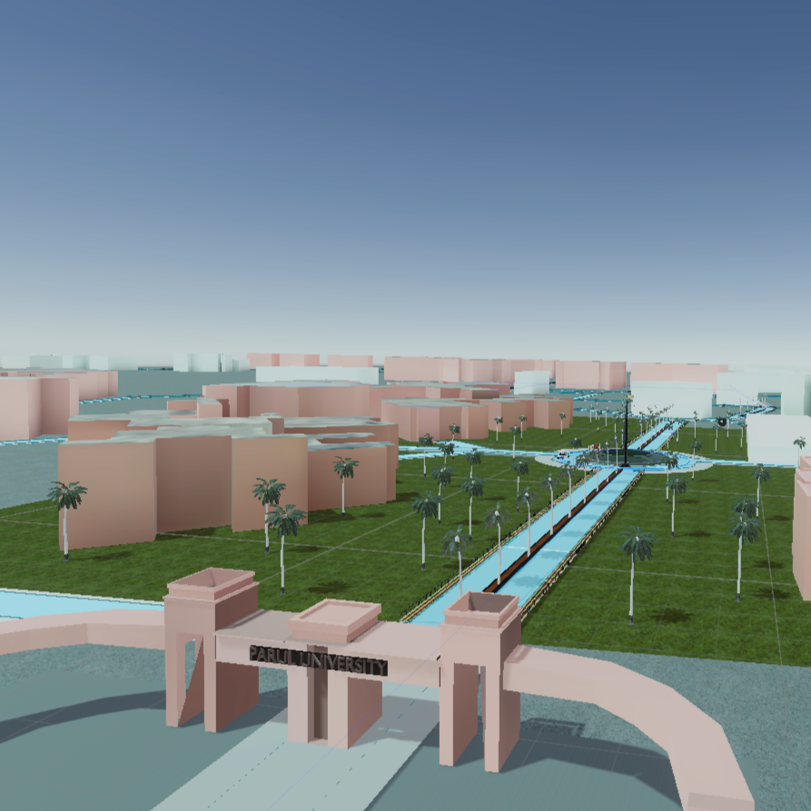
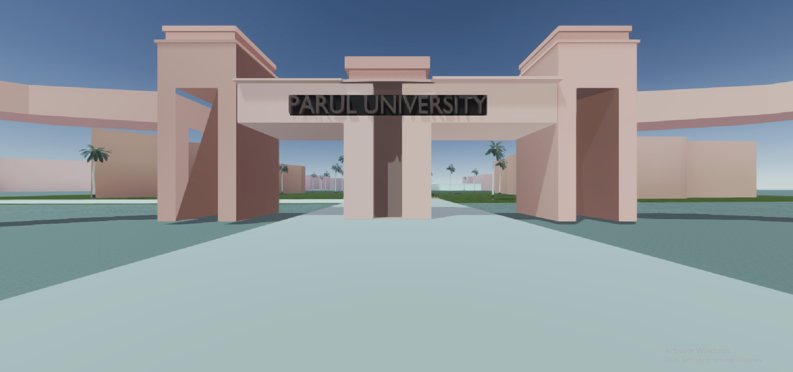
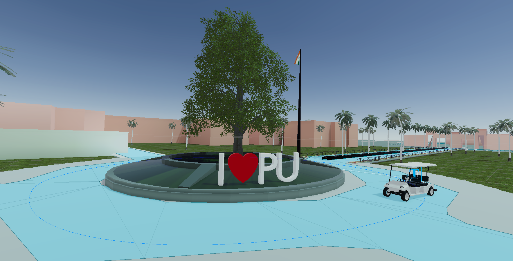

# Parul University VR Campus Tour (Digital Twin) 🎓🥽

A highly optimized Virtual Reality digital twin of the Parul University campus, developed primarily for the **Meta Quest 3**. This project allows users to explore a massive 3D outdoor environment and seamlessly transition into 360-degree photo-based indoor tours. 

Developed as an AR/VR Internship project at the Tinkering Hub, this application balances large-scale open-world rendering with strict mobile VR performance constraints.

## 📸 Project Gallery

*Aerial view of the massive 1:1 scale 3D campus featuring the main entrance.*

*Ground-level perspective of the university's main entrance gate.*

*The central 'I ❤️ PU' circle, demonstrating dynamic foliage and AI-driven EV carts.*

---

## ✨ Key Features

* **Massive Scale Open World:** A 1:1 scale recreation of the campus, featuring custom 3D buildings and road networks.
* **Hybrid Lighting System:** Utilizes Progressive CPU Lightmapping for high-fidelity baked shadows on static architecture, combined with Light Probes and Blend Probes for dynamic objects (like swaying trees) to save Quest 3 memory space.
* **Autonomous EV Navigation:** Integrated Unity AI NavMesh to simulate campus EV cars driving along designated roads and paths, featuring strict obstacle avoidance (e.g., blocking cars from driving on garden meshes).
* **Multi-Platform Ready:** Configured for both **Standalone Mobile VR (Android APK)** for tetherless Quest 3 exploration, and **PC VR (Oculus Link)** for high-end graphical fidelity.
* **Indoor & Outdoor Modes:** Smooth transition from the fully modeled 3D exterior into 360-degree immersive photo skyboxes for indoor exploration.

## 🛠️ Tech Stack & Tools

* **Game Engine:** Unity (URP - Universal Render Pipeline)
* **Target Hardware:** Meta Quest 3, PC VR
* **SDKs & Integrations:** Meta XR SDK
* **3D Pipeline:** Blender (OpenStreetMap data processing, UV unwrap generation), Polybrush (foliage and terrain painting)

## 🚀 Technical Achievements & Optimizations

Building a massive open-world game for a mobile VR headset required aggressive optimization techniques:
1.  **Lightmap Compression:** Reduced a massive GPU bake time down to 5 minutes by utilizing Progressive CPU baking and strategically stripping Global Illumination from complex foliage meshes.
2.  **Draw Call Reduction:** Disabled static batching on heavy prefabs and implemented GPU Instancing for hundreds of dynamic trees, keeping the framerate locked at a smooth 90 FPS to prevent motion sickness.
3.  **Anti-Aliasing for VR:** Replaced Unity's default TAA (Temporal Anti-Aliasing) with MSAA to eliminate visual ghosting and motion blur during head movement.

## 🎮 How to Run

### Standalone VR (Meta Quest 3)
1. Download the latest `.apk` release from the repository.
2. Connect your Quest 3 to your PC.
3. Use [SideQuest](https://sidequestvr.com/) or Meta Quest Developer Hub to sideload the APK onto the headset.
4. Launch the app from "Unknown Sources" in your app library.

### PC VR (Oculus Link)
1. Clone the repository and open it in Unity.
2. Connect your Quest 3 via a high-speed Link Cable.
3. Enable Quest Link in the headset.
4. Press `Play` in the Unity Editor or build the Windows executable.

## 👨‍💻 Developers

**Rushil Sharma** *Team Lead, VR Developer*

**Parth Joshi** *3D Modeler*

**Ruchit Madhavi** *3D Modeler*

*B.Tech CSE-CE, Parul University*

---
*Note: This project is currently in active development.*
